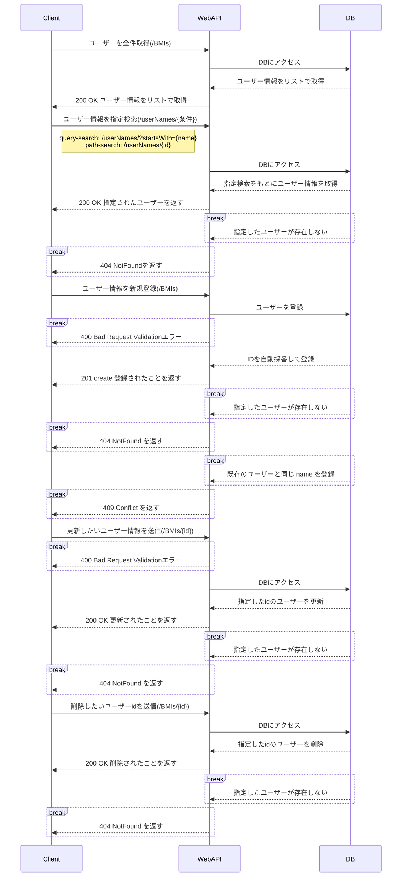

# 従業員肥満度管理システム

## 使用技術一覧

## サービス概要

- このプロジェクトでは 従業員の身体情報を管理します。
- 名前、年齢、身長、体重をセットに id で紐づけます。
- 上記の内容について、読み取り、登録、更新、削除を行うことができます。
- 登録された身長、体重に対してBMI値が自動で算出され、読み取りで確認することができます。

## 開発環境

- Java 17
- Spring Boot 3.3.1
- MySQL 8

## 機能一覧

Open Api を使用して、下記にまとめました。
[BMIチェッカー/仕様書](https://teddypr.github.io/bmi-checker/)

## DBについて

### テーブル名： BMIs

| column |  data type   | Nou null | description |    memo    |
|:------:|:------------:|:--------:|:-----------:|:----------:|
|   id   |     int      | NOTNULL  |   id自動採番    | primaryKey |
|  name  | VARCHAR(255) | NOTNULL  |     名前      |   UNIQUE   |
|  age   |     int      | NOTNULL  |     年齢      |            |
| height |  FLOAT(5,1)  | NOTNULL  |     身長      |            |
| weight |  FLOAT(5,1)  | NOTNULL  |     体重      |            |

## シーケンス図

## 自動テスト

以下の自動テストを実装

- BmiService の単体テスト
- BmiMapperのDBテスト
- Integrationテスト（結合テスト）
- GitHub Actions
