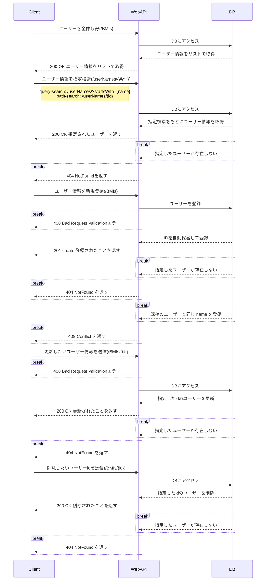

# 肥満度管理システム

## 使用技術一覧

## サービス概要

- このプロジェクトでは 従業員の BMI を管理する RESTful な Web API を作成します。
- 名前、年齢、身長、体重をセットに id で紐づけて登録します。登録の際 id は自動で採番されます。
- これらの従業員のボディデータの読み取り、登録、更新、削除を行うことができます。
- 読み取りの際は、データベース内の身長、体重の情報から自動で肥満度指数 BMI を計算して返します。

## 開発環境

- Java 17
- Spring Boot 3.3.1
- MySQL 8

## 機能一覧

| API     | Method |              Path               |
|:--------|:------:|:-------------------------------:|
| 従業員全件検索 |  GET   |              /BMIs              |
| 従業員名前検索 |  GET   | /userNames?startsWith={acronym} |
| 従業員ID検索 |  GET   |         /userNames/{id}         |
| 従業員新規登録 |  POST  |              /BMIs              |
| 従業員更新処理 | PATCH  |           /BMIs/{id}            |
| 従業員削除処理 | DELETE |           /BMIs/{id}            |

#### Read機能（GET）

- 従業員の名前を全件取得するAPI
    - リクエスト
        - Method: GET
        - URL: /BMIs
    - レスポンス
        - ステータスコード： 200
        - ボディ： ユーザーのリストを Json 形式で返す
      ```curl
      curl --location 'http://localhost:8080/BMIs'
      ```

- クエリ文字列で指定した name のレコードを取得するAPI
    - リクエスト
        - Method: GET
        - URL: /userNames?startsWith={name}

    - レスポンス
        - ステータスコード： 200
        - ボディ： ユーザーのリストを Json 形式で返す
        - ID が存在しない場合はステータスコード 404 を返す
      ```curl
      curl --location 'http://localhost:8080/userNames?startsWith=%E3%82%BF'
      ```

200 の場合のレスポンス

  ```json
  [
  {
    "id": 18,
    "name": "タカハシ　カズキ",
    "age": 31,
    "height": 170.6,
    "weight": 67.8,
    "bmi": 23.295478753011576
  },
  {
    "id": 1,
    "name": "タナカ　イチロウ",
    "age": 20,
    "height": 171.5,
    "weight": 60.2,
    "bmi": 20.46766228357232
  }
]
  ```

404 の場合のレスポンス

  ```json
{
  "message": "該当する従業員は存在しません",
  "timestamp": "2024-07-21T13:52:04.670926+09:00[Asia/Tokyo]",
  "error": "Not Found",
  "path": "/userNames",
  "status": "404"
}
  ```

- 指定した ID のレコードを取得するAPI

    - リクエスト
        - Method: GET
        - URL: /userNames/{id}
    - レスポンス
        - ステータスコード： 200
        - ボディ： ユーザーのリストを Json 形式で返す
        - ID が存在しない場合はステータスコード 404 を返す
      ```curl
      curl --location 'http://localhost:8080/userNames/1'
      ```

  200 の場合のレスポンス
  ```json
  {
    "id": 1,
    "name": "タナカ　イチロウ",
    "age": 20,
    "height": 171.5,
    "weight": 60.2,
    "bmi": 20.46766228357232
  }
  ```

  404 の場合のレスポンス

  ```json
  {
    "error": "Not Found",
    "timestamp": "2024-07-07T22:23:44.657353+09:00[Asia/Tokyo]",
    "message": "該当する従業員はいません",
    "status": "404",
    "path": "/userNames/100"
  }
  ```

<br>

#### Create処理（POST）

- ユーザー情報を登録するAPI

    - リクエスト
        - Method: POST
        - URL: /BMIs
    - レスポンス
        - ステータスコード： 201
        - ボディ： Json形式で "New data is created" を返す
        - 同姓同名のユーザーが登録された場合はステータスコード 409 を、 空のデータが登録された場合はステータスコード 400
          を返す

200 の場合のレスポンス

   ```json
  {
  "message": "New data is created"
}
  ```

409 の場合のレスポンス

  ```json
  {
  "status": "409",
  "path": "/BMIs",
  "error": "Conflict",
  "timestamp": "2024-07-15T22:46:24.616755+09:00[Asia/Tokyo]",
  "message": "同じ名前のデータが既に存在します"
}
  ```

400 の場合のレスポンス

- 以下の条件いずれかを満たさずに入力した時

  ```json
  {
    "name": "名前は必須項目です",
    "name": "名前は 20 字以内で入力してください",
  
    "age": "年齢は必須項目です",
    "age": "年齢は正の整数でなければなりません",
  
    "height": "身長は必須項目です",
    "height": "身長は単位メートルで正の数でなければなりません",
    "height": "身長は小数点第 1 位までで入力してください",
  
  　"weight": "体重は必須項目です",
    "weight": "体重はキログラム単位で正の数でなければなりません",
    "weight": "体重は小数点第 1 位までで入力してください"
  }
  ```

- json の形式に誤りがある時（Postman に赤線が入る時）

 ```json
  {
  "timestamp": "2024-07-15T13:53:24.763+00:00",
  "status": "400",
  "error": "Bad Request",
  "path": "/BMIs"
}
  ```

<br>

#### Update処理（PUT）

- ユーザー情報を登録するAPI

    - リクエスト
        - Method: PATCH
        - URL: /BMIs/{id}
    - レスポンス
        - ステータスコード： 200
        - ボディ： Json形式で "従業員情報 更新完了" を返す
        - 存在しないIDを指定された場合は、ステータスコード 404 を返す

200 の場合のレスポンス

```json
{
  "message": "従業員情報　更新完了"
}
```

404 の場合のレスポンス

```json
{
  "error": "Not Found",
  "timestamp": "2024-07-21T23:32:28.013531+09:00[Asia/Tokyo]",
  "message": "存在しない従業員 ID です: 100",
  "status": "404",
  "path": "/BMIs/100"
}
```

<br>

#### Delete処理 (DELETE)

- ユーザー情報を登録するAPI

    - リクエスト
        - Method: DELETE
        - URL: /BMIs/{id}
    - レスポンス
        - ステータスコード： 200
        - ボディ： Json形式で "従業員情報 削除完了" を返す
        - 存在しないIDを指定された場合は、ステータスコード 404 を返す

200 の場合のレスポンス

```json
{
  "message": "従業員情報　削除完了"
}
```

404 の場合のレスポンス

```json
{
  "error": "Not Found",
  "path": "/BMIs/100",
  "status": "404",
  "message": "存在しない従業員 ID です: 100",
  "timestamp": "2024-07-21T22:57:39.008982+09:00[Asia/Tokyo]"
}
```

<br>

## DBについて

### テーブル名： BMIs

| column |  data type   | Nou null | description |    memo    |
|:------:|:------------:|:--------:|:-----------:|:----------:|
|   id   |     int      | NOTNULL  |   id自動採番    | primaryKey |
|  name  | VARCHAR(255) | NOTNULL  |     名前      |   UNIQUE   |
|  age   |     int      | NOTNULL  |     年齢      |            |
| height |  FLOAT(5,1)  | NOTNULL  |     身長      |            |
| weight |  FLOAT(5,1)  | NOTNULL  |     体重      |            |

## シーケンス図



## 自動テスト

以下の自動テストを実装

- BmiService の単体テスト
- BmiMapperのDBテスト
- BmiIntegrationテスト(結合テスト)の実装

